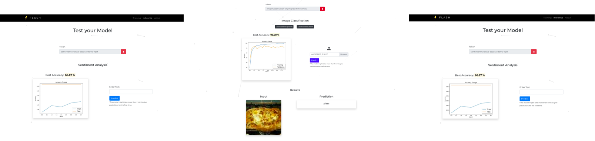
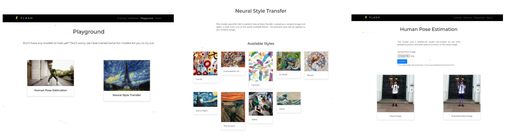

<h1> Flash</h1>

Link to project: https://shan18.github.io/Flash

Flash is an **end-to-end Deep Learning** platform that allows users to create, train, and deploy their own neural network models in a matter of minutes without writing a single line of code.

The platform currently supports two types of tasks:

### Image Classification

Classify images from your own dataset by using them to train a **ResNet-34** or **MobileNet v2** model. Training happens via transfer learning where models available will be pre-trained on the ImageNet dataset.

  

### Text Classification

Classify sentences by training a **LSTM** or **GRU** based sequential model on your own dataset. The models will be trained from scratch.

  

## How It Works

Using Flash is easy. With just a few clicks you can train and deploy your models automatically. You just have to select your model and upload the dataset, and you're good to go. **No code or experience required**.

### Training

For training a model, you'll have to **upload your own dataset** and **select the model parameters**. Depending on the size of the dataset, the model can take anywhere between **3 - 10 minutes to train and deploy your model**.

After you upload your configuration, the platform will assign you a unique **token**. Please save the token as it will used to test the model on the inference page.

### Inference

You can perform inference on a trained model by using the **token** provided to you after submitting the training configuration on the training page.

After submitting the token, you'll get a form where you can upload inputs to check the performance of your trained model. The inference page also provides you with the **results of the training process** by showing you the **accuracy** of the model **on validation set** as well as the **change in accuracy** during training.

### Playground

Don't have any models to train yet? Don't worry, we have trained some fun models such as **Human Pose Estimation** and **Neural Style Transfer** for you to try out in the Playground page. The models are already trained and deployed so that you can directly perform inference on them.

## Behind the Scenes

Flash uses React Js, AWS Lambda, AWS S3 and AWS EC2 to function properly. To know about how flash functions, read the following links in order

1. [Config JSON Files](config_json/README.md)
2. [Training Models](train_config/README.md#How-it-works)
3. [Performing Inference](inference/README.md#How-it-works)

## Setup Instructions

To setup Flash from scratch, read the following links in order

1. Install serverless. For reference, check [this link](https://www.serverless.com/framework/docs/providers/aws/guide/installation/)
2. [Setup config files](config_json/README.md#Setup-Instructions)
3. [Training server setup](train_config/README.md#Setup-Instructions)
4. [Setting up Infernce](inference/README.md#Setup-Instructions)
5. [Frontend using React](flash_web/README.md#Setup-Instructions)

## Contact/Getting Help

If you need any help or want to report a bug, raise an issue in the repo.
