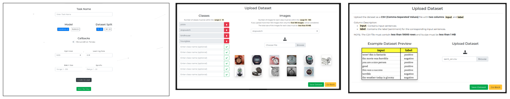

<h1>Project  Flash</h1>

Flash is an **end-to-end Deep Learning** platform which allows users to create, train and deploy their own neural network models in a matter of minutes without writing a single line of code.

The platform currently supports two types of tasks:

### Image Classification

Classify images from your own dataset by using them to train a **ResNet-34** or **MobileNet v2** model. Training happens via transfer learning where models available will be pre-trained on the ImageNet dataset.

  

### Sentiment Analysis

Predict sentiment from sentences by training a **LSTM** or **GRU** based sequential model on your own dataset. The models will be trained from scratch.

  

## How It Works

Using Flash is easy. With just a few clicks you can train and deploy your models automatically. You just have to select your model and upload the dataset, and you're good to go. **No code or experience required**.

### Training

For training a model, you'll have to **upload your own dataset** and **select the model parameters**. Depending on the size of the dataset, the model can take anywhere between **3 - 10 minutes to train and deploy your model**.

After you upload your configuration, the platform will assign you a unique **token**. Please save the token as it will used to test the model on the inference page.

### Inference

You can perform inference on a trained model by using the **token** provided to you after submitting the training configuration on the training page.

After submitting the token, you'll get a form where you can upload inputs to check the performance of your trained model. The inference page also provides you with the **results of the training process** by showing you the **accuracy** of the model **on validation set** as well as the **change in accuracy** during training.

