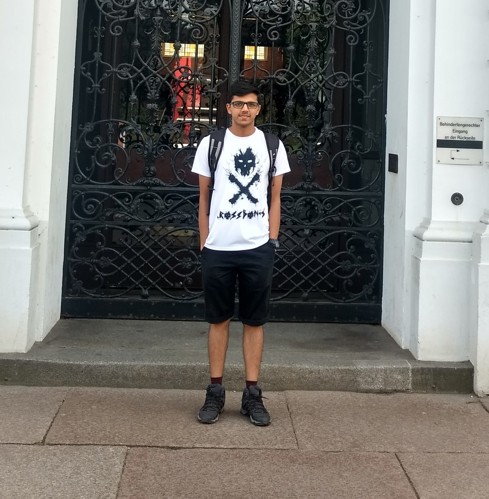
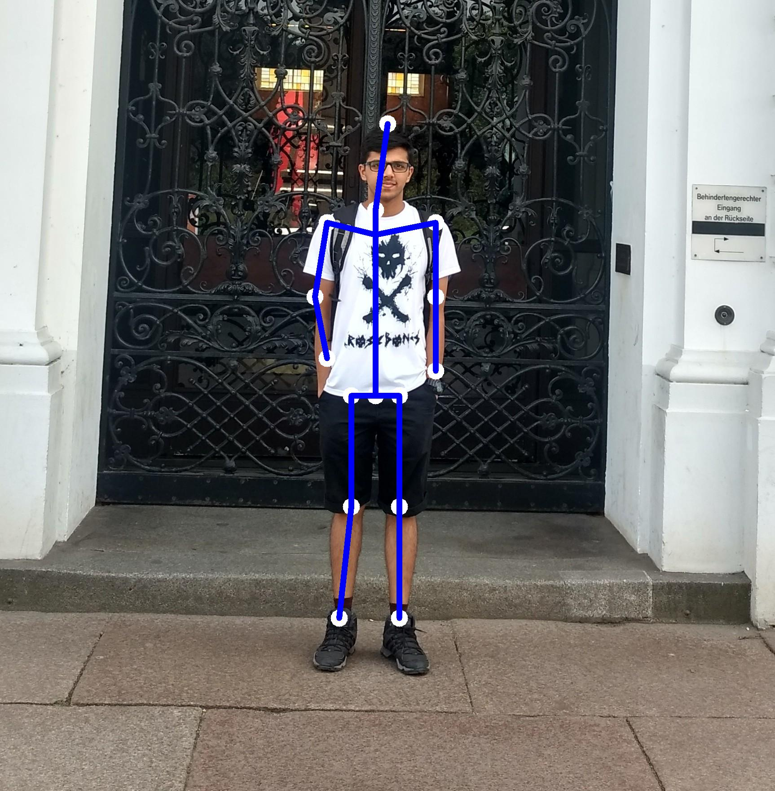

# Playground

Page Link: https://shan18.github.io/Flash/playground

This directory contains the code to setup the lambda modules present in the Playground section.

## Human Pose Estimation

Pose Tracking is the task of estimating multi-person human poses in videos and assigning unique instance IDs for each keypoint across frames. Accurate estimation of human keypoint-trajectories is useful for human action recognition, human interaction understanding, motion capture and animation.

For code and instructions on how to setup the lambda function, checkout the [human_pose_estimation](human_pose_estimation/) directory.

|                                     Input Image                                      |                                      Output Image                                       |
| :----------------------------------------------------------------------------------: | :-------------------------------------------------------------------------------------: |
|  |  |

## Neural Style Transfer

Neural style transfer is an artificial system based on a Deep Neural Network that creates artistic images of high perceptual quality. The system uses neural representations to separate and recombine content and style of arbitrary images, providing a neural algorithm for the creation of artistic images.

For code and instructions on how to setup the lambda function, checkout the [neural_style_transfer](neural_style_transfer/) directory.

|                                              Input Image                                               |                                        Style Image                                        |                                               Output Image                                               |
| :----------------------------------------------------------------------------------------------------: | :---------------------------------------------------------------------------------------: | :------------------------------------------------------------------------------------------------------: |
|                |   |               |
|  |  |  |

## Tech Stack

- AWS Lambda
- Serverless
- AWS S3
- PyTorch
- Torchvision

## Code Structure

The playground module contains **2 lambda functions**

1. **`human_pose_estimation`**: Draws pose of a human by detecting keypoints in the input image.
2. **`neural_style_transfer`**: Applies a style of choice to any given input image.

## How it works

1. Each lambda function has its own page in the playground section of the website.
2. User goes to the respective lambda function's page and uploads the required input data.
3. After clicking submit, the corresponding lambda function fetches the model from S3, performs inference and returns the output to the fronend.
4. The frontend shows the returned output to the user on the webpage.
