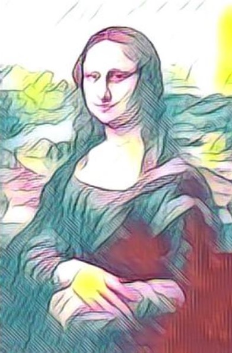
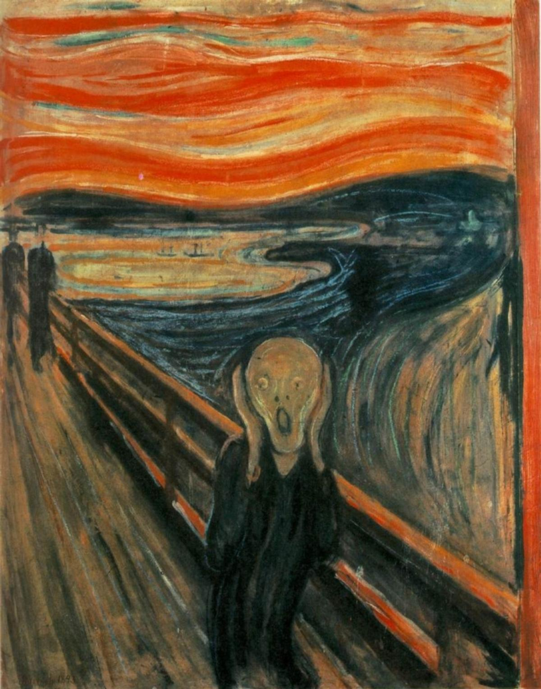
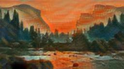

# Playground

This directory contains the code to setup the two models present in the Playground section

- Human Pose Estimation
- Neural Style Transfer

## Human Pose Estimation

Pose Tracking is the task of estimating multi-person human poses in videos and assigning unique instance IDs for each keypoint across frames. Accurate estimation of human keypoint-trajectories is useful for human action recognition, human interaction understanding, motion capture and animation.

For code and instructions on how to setup the lambda function, checkout the [human_pose_estimation](human_pose_estimation/) directory.

### Results

|                                     Input Image                                      |                                      Output Image                                       |
| :----------------------------------------------------------------------------------: | :-------------------------------------------------------------------------------------: |
|  |  |

## Neural Style Transfer

Neural style transfer is an artificial system based on a Deep Neural Network that creates artistic images of high perceptual quality. The system uses neural representations to separate and recombine content and style of arbitrary images, providing a neural algorithm for the creation of artistic images.

For code and instructions on how to setup the lambda function, checkout the [neural_style_transfer](neural_style_transfer/) directory.

### Results

|                                              Input Image                                               |                                        Style Image                                        |                                               Output Image                                               |
| :----------------------------------------------------------------------------------------------------: | :---------------------------------------------------------------------------------------: | :------------------------------------------------------------------------------------------------------: |
|                |   |               |
|  |  |  |
